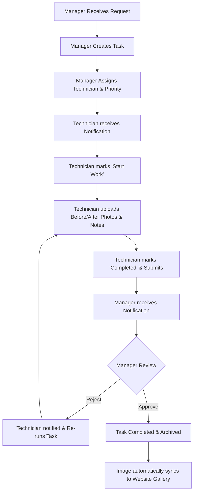

# Walkthrough - Phase 4B Complete (Unified Field Operations & Task Lifecycle)

I have successfully completed Phase 4B, refactoring the portal into a robust, task-centric field operations platform. The portal now enables seamless workflows where managers create, assign, and verify tasks, and technicians execute them via a mobile-first UI with photo evidence uploads, live timelines, and in-app notifications.

---

## 1. Core Workflow & Operations

---

## 2. Completed Modules & Files

### 2.1 Database & Client Setup
*   **Database Schema (`database_fix.sql`)**: Completed remote migrations with RLS policies, recursion-free security configurations, and full structures for `tasks`, `notifications`, and `gallery` tables.
*   **Supabase Client (`src/lib/supabase.ts`)**: Upgraded `Task`, `Notification`, and `GalleryItem` definitions. Hooked up simulated storage upload streams and seeded high-fidelity mock assets for local-first execution.
*   **UI Components**:
    *   [badge.tsx](file:///C:/Users/sreya/antigravity/scratch/it-security-portal/src/components/ui/badge.tsx): Created modern, styled badge UI element to handle priority levels and task statuses.
    *   [NotificationBell.tsx](file:///C:/Users/sreya/antigravity/scratch/it-security-portal/src/components/layout/NotificationBell.tsx): Implemented bell dropdown in top header layout, listing unread dispatches and handling instant read sweeps.

### 2.2 Manager Panel Refactoring
*   [ManagerDashboard.tsx](file:///C:/Users/sreya/antigravity/scratch/it-security-portal/src/pages/portal/ManagerDashboard.tsx): Modernized analytics dashboard containing Total, Active, Review, and Emergency gauges, followed by a Technician performance board displaying completion rates.
*   [ManagerTasks.tsx](file:///C:/Users/sreya/antigravity/scratch/it-security-portal/src/pages/portal/ManagerTasks.tsx): Operational control center for creating tasks, reassigning technicians, auditing logs, and reviewing submissions (approving or rejecting with descriptions).
*   [Reports.tsx](file:///C:/Users/sreya/antigravity/scratch/it-security-portal/src/pages/portal/Reports.tsx): Consolidated analytics comparing technician completion rates, general field summaries, and log audits.
*   [GalleryManagement.tsx](file:///C:/Users/sreya/antigravity/scratch/it-security-portal/src/pages/portal/GalleryManagement.tsx): Showcase upload panel for managers to publish finished field installations directly to the public website.

### 2.3 Technician Mobile-First Portal
*   [MyTasks.tsx](file:///C:/Users/sreya/antigravity/scratch/it-security-portal/src/pages/portal/MyTasks.tsx): Mobile-first card deck representing assigned works, filterable by status categories (Assigned, Active, Review, Done) and due dates.
*   [TaskDetails.tsx](file:///C:/Users/sreya/antigravity/scratch/it-security-portal/src/pages/portal/TaskDetails.tsx): Rich visual console letting field technicians:
    *   Access client details, call lines, and maps directions.
    *   Launch tasks ("Start Work").
    *   Upload Before, After, and Completion photos (snapping camera frames on mobile).
    *   Write field logs and submit tasks for review.
    *   Review chronological activity timelines.

### 2.4 Website Integration
*   [Gallery.tsx](file:///C:/Users/sreya/antigravity/scratch/it-security-portal/src/pages/Gallery.tsx): Rebuilt public gallery page. Queries the database `gallery` table, dynamically categorizes uploads based on keyword metadata, and falls back gracefully to default assets to keep page design premium.

---

## 3. Deployment & Production Checks

*   **TypeScript Compiling**: Verified by executing `npm run build`. Compiles clean with exit code `0` and generates production bundles inside `dist/`.
*   **Supabase Storage Buckets**:
    *   `task-evidence`: Created to store Before/After technician pictures.
    *   `gallery-images`: Created to store manager-published public highlights.

---

## 4. Operational Testing Script

Follow this checklist to verify the full task life-cycle:

1.  **Manager Task Dispatch**:
    *   Log in as Sarah Manager (`manager@itsec.com`).
    *   Go to **Tasks** -> Click **Create Task** -> Assign to Alex Technician with high priority.
2.  **Technician In-box & Start**:
    *   Log in as Alex Technician (`tech@itsec.com`).
    *   Check notifications bell (alert shows new task).
    *   Go to **My Tasks** -> Click task to open details.
    *   Click **Start Work Now**. (Timeline logs event).
3.  **Uploading Photos & Notes**:
    *   Under "Work Photo Evidence", click **Snap / Add** in "Before Photos" and upload a file.
    *   Perform work, upload "After Photos".
    *   Write notes: "Lobby CCTV setup completed, feed testing successful."
    *   Click **Submit for Manager Review**. (Status turns to review).
4.  **Manager Audit & Rejection/Approval**:
    *   Switch to Sarah Manager.
    *   Check notification (Alex submitted task).
    *   Open **Tasks** -> Click **Verify Completion** on Alex's task.
    *   Review notes, view uploaded photos.
    *   Click **Approve Task Completed** (task status updates to Completed) OR click **Reject** and write reason (task goes back to Alex with notes).
5.  **Gallery Sync**:
    *   On Manager portal -> Go to **Gallery Management** -> Upload a finished CCTV rack photo.
    *   Log out and go to public website -> **Project Showcase**. Confirm the new image shows under the correct filtered category.
